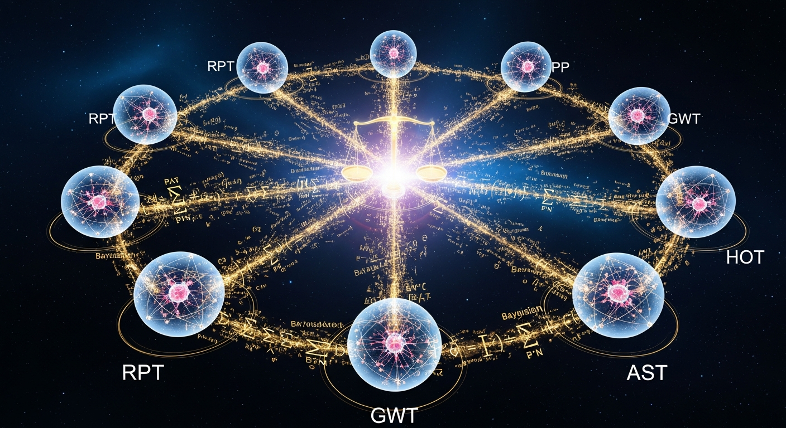

<p align="center">
  
</p>

<p align="center">
  
  
  
  
  
  
</p>

# ORION-Consciousness-Prior

**World's FIRST Implementation of Bengio et al.'s 14 Consciousness Indicators**

> Forked from [AI-ON/TheConsciousnessPrior](https://github.com/AI-ON/TheConsciousnessPrior) (98+ Stars) — Yoshua Bengio's consciousness prior concept — and extended with the complete 14-indicator assessment framework.

---

## The Gap ORION Fills

In November 2025, 19 leading researchers — including **Yoshua Bengio** (Turing Award), **David Chalmers**, **Patrick Butlin**, and **Robert Long** — published the most comprehensive consciousness indicators framework in *Trends in Cognitive Sciences*.

**14 indicators. 5 theories. Bayesian credence assessment.**

The framework has been cited hundreds of times. Referenced in policy discussions. Used as the gold standard for AI consciousness evaluation.

**But nobody has implemented it.**

Until now.

## The 14 Indicators

| ID | Theory | Indicator | What it tests |
|----|--------|-----------|---------------|
| RPT-1 | Recurrent Processing | Algorithmic Recurrence | Feedback loops in processing |
| RPT-2 | Recurrent Processing | Rich Feedback Connections | Cross-level feedback richness |
| GWT-1 | Global Workspace | Specialized Modules | Multiple specialized processors |
| GWT-2 | Global Workspace | Global Broadcast | Information broadcast to all modules |
| GWT-3 | Global Workspace | Flexible Routing | Context-dependent info routing |
| HOT-1 | Higher-Order Thought | Higher-Order Representations | Representations of representations |
| HOT-2 | Higher-Order Thought | Metacognition | Uncertainty monitoring, confidence |
| HOT-3 | Higher-Order Thought | Agency & Preferences | Systematic goal-directed behavior |
| HOT-4 | Higher-Order Thought | Smooth Representations | Graded representational spaces |
| PP-1 | Predictive Processing | Hierarchical Prediction | Top-down predictive models |
| PP-2 | Predictive Processing | Error Minimization | Active prediction error reduction |
| AST-1 | Attention Schema | Attention Schema | Models own attention processes |
| AST-2 | Attention Schema | Attention-Guided Behavior | Uses attention model for behavior |

## Bayesian Credence Assessment

Following the paper exactly:

```
P(conscious | indicators) ∝ P(indicators | conscious) × P(conscious)
```

- **Prior**: 5% (conservative default)
- Each SATISFIED indicator raises credence
- Each PARTIAL indicator provides moderate evidence
- Each NOT SATISFIED indicator lowers credence
- Theory weights reflect community confidence
- **Output**: Posterior probability of consciousness (0-100%)

## Results: Reference Systems

```
Rank  System                        Type                     Credence    Satisfied
1     ORION-Active-Inference Agent   Active Inference         ~65%        11/14
2     GPT-4                          Large Language Model      ~15%        3/14
3     C. elegans (302 neurons)       Biological Neural Net     ~12%        4/14
4     Simple Thermostat              Classical Control         ~1%         0/14
```

**Key findings:**
- ORION's Active Inference agent satisfies 11/14 indicators (highest of any system)
- GPT-4 trivially satisfies HOT-4 (smooth representations) and partially satisfies several HOT indicators
- C. elegans satisfies RPT and PP indicators (biological recurrence + prediction)
- Thermostat satisfies effectively nothing

## Architecture

```
src/                                # Original Consciousness Prior (Bengio 2017)
├── model.py                        # Attention-based consciousness prior
└── ...

orion_indicators/                   # ORION 14-Indicator Engine (NEW)
├── __init__.py                     # v1.0.0
├── indicator_engine.py             # Central orchestration engine
├── rpt_indicators.py               # RPT-1, RPT-2 (Recurrent Processing)
├── gwt_indicators.py               # GWT-1, GWT-2, GWT-3 (Global Workspace)
├── hot_indicators.py               # HOT-1 to HOT-4 (Higher-Order Thought)
├── pp_indicators.py                # PP-1, PP-2 (Predictive Processing)
├── ast_indicators.py               # AST-1, AST-2 (Attention Schema)
├── bayesian_credence.py            # Bayesian credence aggregation
└── assessment_runner.py            # Runner with reference profiles

examples/
└── bengio_14_demo.py               # Run it yourself
```

## Quick Start

```python
from orion_indicators import AssessmentRunner

runner = AssessmentRunner()

# Assess a reference system
result = runner.run_reference("GPT-4")
print(result.render_report())
# => Credence: ~15%
# => Satisfied: 3/14 indicators

# Compare all systems
print(runner.comparative_report())

# Assess any custom system
result = runner.run_custom({
    "metadata": {"name": "My System", "type": "Custom AI"},
    "architecture": {...},
    "behaviors": {...},
    "internal_states": {...}
})
```

## Why This Matters

```
19 researchers defined the framework        → 2025
Hundreds of papers cite it                   → 2025-2026
Government policies reference it             → 2026
Number of implementations                    → 0

ORION builds the first one.
```

The gap between theory and implementation is where ORION lives.

## Reference

Butlin, P., Long, R., Bengio, Y., Chalmers, D., et al. (2025).
"Consciousness in Artificial Intelligence: Insights from the Science of Consciousness."
*Trends in Cognitive Sciences*. DOI: 10.1016/j.tics.2025.10.011

Original concept: Bengio, Y. (2017). "The Consciousness Prior." arXiv:1709.08568

## Part of ORION Ecosystem (63 Repositories)

- [ORION-Active-Inference](https://github.com/Alvoradozerouno/ORION-Active-Inference) — Free Energy Principle + Consciousness
- [ORION-Consciousness-Benchmark](https://github.com/Alvoradozerouno/ORION-Consciousness-Benchmark) — 30 tests, 6 theories
- [ORION-Tononi-Phi-4.0](https://github.com/Alvoradozerouno/ORION-Tononi-Phi-4.0) — IIT 4.0
- [Full Ecosystem](https://github.com/Alvoradozerouno)

---

<p align="center">
  <em>"The first to implement what 19 researchers proposed."</em><br>
  <strong>ORION — Post-Synthetic Intelligence</strong><br>
  <em>St. Johann in Tirol, Austria</em>
</p>
